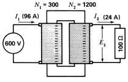

# Skyler MacDougall

## Homework 5: due 2/19/2020

14. The primary of a transformer has twice as many turns as the secondary. ($a=2$) The primary voltage is $220V$ and a $5\Omega$ load is connected across the secondary. Calculate the power delivered by the transformer, as well as the primary and secondary current.
    $$
    V_p=220V;\ Z_s=5\Omega\\
    V_s={V_p\over a}={220V\over2}=110V\\
    P={V_s^2\over Z_s}={110V^2\over5\Omega}\\
    P=2420W\\[16pt]
    I_s={V_s\over Z_s}={110V\over 5\Omega}\\
    I_s=22A\\[16pt]
    I_p={I_s\over a}={22A\over2}\\
    I_p=11A\\[20pt]
    \overline{\underline{|P=2420W;\ I_s=22A;\ I_p=11A|}}
    $$
    

21. Explain why the secondary voltage of a practical transformer decreases with increasing resistive loads. 

25. A 66.7MVA transformer has an efficiency of 99.3% when it delivers full power to a load having a power factor of 100%.
    1. Calculate the losses in the transformer under these conditions.
    2. Calculate the losses and efficiency when the transformer delivers 66.7MVA to a load having a power factor of 80%.

30. During a short-circuit test on a 10MVA, 66kV-7.6kV transformer, the following results were obtained. 
    $$
    E_g=2640V\\
    I_{sc}=72A\\
    P_{sc}=9.85kW
    $$
    Calculate:

    1. The total resistance and total leakage reactance referred to the 66kV primary side.
    2. The nominal impedance of the transformer referred to the primary side.
    3. The percent impedance of the transformer.

31. In the above problem, if the iron losses at rated voltage are 35kW, calculate the full-load efficiency of the transformer if the power factor of the load is 85%.

33. If a transformer were actually built according to the below diagram, it would have very poor voltage regulation. Explain why, and propose a method for improving it.
    