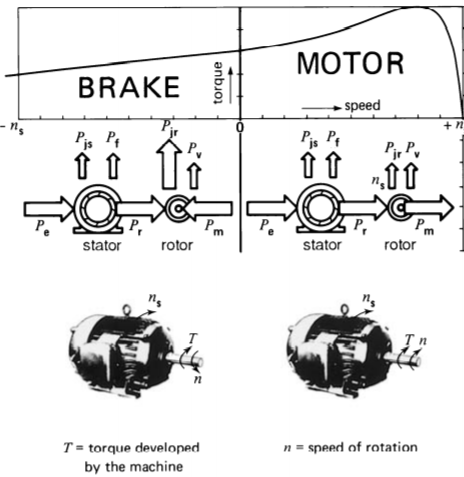

# Skyler MacDougall

## Homework 9: due 3/25/2020

1.  What is the difference between a drip-proof motor and an explosion-proof motor?
    Drip-proof motors are protected from dripping liquids up to 15 degrees from the vertical. An explosion-proof motor, by contrast, are fully sealed, and the frames are designed to withstand the enormous pressure.

2.  What is the approximate life expectancy for a motor?
    It depends on the size, speed, horsepower, what voltage and current its run at, and how long it is run at one time.

3.  Explain what a NEMA Design D motor is unsatisfactory for driving a pump.
    A pump should be a consistent speed, and shouldn't take long to get to full speed. A NEMA Design D motor achieves neither of these.

4.  Identify the motor components shown in Fig. 3
    

5.  Show the flow of active power in a 3-phase induction motor when it operates

    1.  As a motor.
        Power is being put into the system in the same direction as rotation.
    2.  As a brake.
        Power is being put in in the opposite direction of rotation. As such, a lot of power is lost as heat.

    

6.  Will a 3--phase motor continue to rotate if one of the lines becomes open? Will the motor be able to start on such a line?
    The motor needs all 3 phases to start. It will be able to run with only two phases, but there will be a lot of excess heat, and the motor will wear out faster. 

14. A 300hp, 2.3kV, 3-phase, 60Hz, squirrel-cage induction motor turns at a full-load speed of 590r/min. Calculate the approximate value of rotor $I^2R$ losses. 
    $$
    P_{jr}=({120{f\over p}-n\over 120{f\over p}})*(3P)\\
    P_{jr}=({120{60Hz\over 6\ poles}-590rpm\over 120{60Hz\over 6\ poles}})*(3(300hp*746W/hp))\\
    P_{jr}=({1200rpm-590rpm\over 1200rpm})*(3(223.8kW))\\
    P_{jr}=(0.508\overline3)*(3(223.8kW))\\
    \underline{\overline{|P_{jr}=341.295kW|}}
    $$
    If the line voltage then drops to 1944V, calculate the following:
    
    1. The new speed, knowing that the load torque remains the same.
        $$
        n=1200(1-s({V_1\over V_2})^2)=1200(1-0.508\overline3({2300V\over 1944V})^2)\\
        n=346rpm
        $$
    
    2. The new power output.
        $$
        P'=P*{n'\over n}=300hp*{346rpm\over 590rpm}\\
        P'=176.34hp\approx131.6kW
        $$
        
    3. The new $I^2R$ losses in the rotor.
        $$
        P_{jr}=({120{f\over p}-n\over 120{f\over p}})*(3P)\\
        P_{jr}=({120{60Hz\over 6\ poles}-346rpm\over 120{60Hz\over 6\ poles}})*(3(131.6kW))\\
        P_{jr}=0.711\overline6*3(131.6kW)\\
        P_{jr}=280.6kW
        $$
        

27.  The bearings in a motor have to be greased regularly, but not too often. The following schedule applies to two motors:
     Motor A: 75hp, 3550r/min; lubricate every 2200 hours of running time.
     Motor B: 75hp,   900r/min; lubricate every 10000 hours of running time.
     Motor A runs continually, 24 hours per day. Motor B drives a compressor and operates about 6 hours per day. How often should the bearings of each motor be greased per year?
     Motor A should be greased about once every quarter, or 4 times in a year.
     Motor B should be greased about once every 5 years.

28.  A 40hp 1780r/min, 460V, 3-phase, 60Hz, drip proof Baldor Super E premium energy induction motor has a power factor of 86% and an efficiency of 93.6%. The motor, priced at $2243, runs at full-load 12 hours a day, 5 days a week. Calculate the driving cost of the motor during a 3-year period, knowing that the cost of energy is \$0.06/kWh.
     $$
     12\ hours*5\ days/week\ *52\ weeks/year*3\ years=9360\ hours\\
     P_{in}={P_{out}\over eff}={40hp*746W/hp\over0.936}=31.9kW\\
     Cost=price/kWh*kW*h=\$0.06*9360\ hours*31.9kW\\
     Running\ cost=\$17,904.00\\
     Cost\ w/\ motor=\$20,147.00
     $$
     