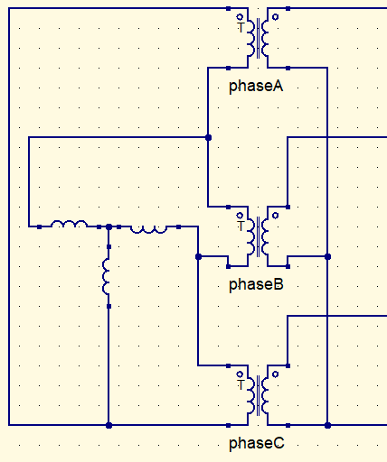
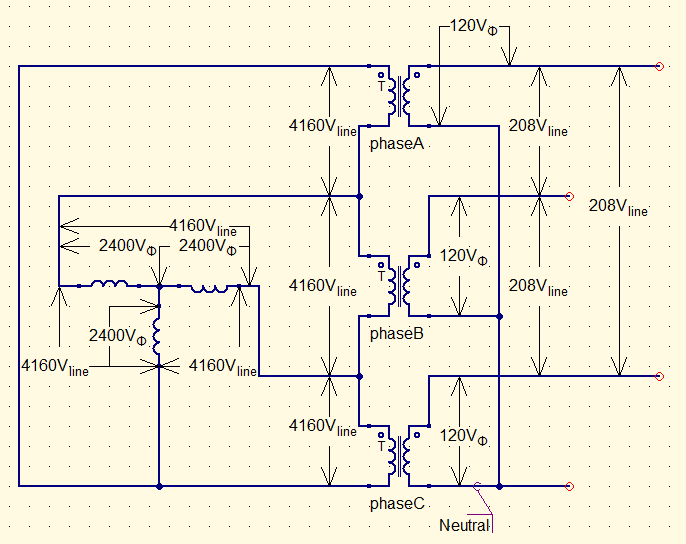
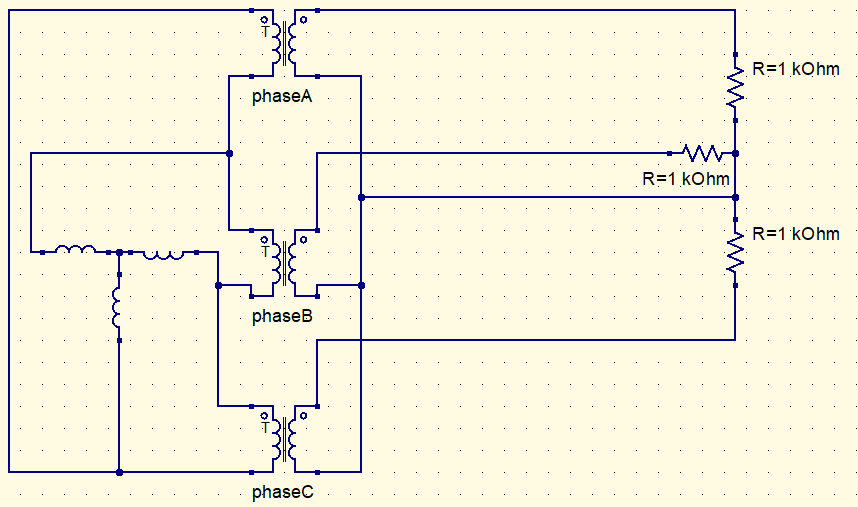
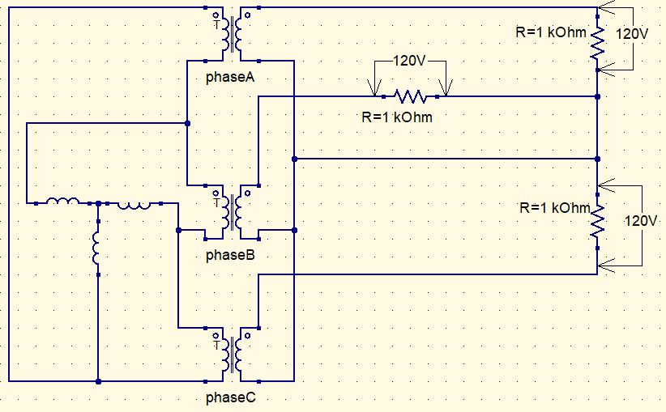

1.  Draw the circuit of a 3-phase 4160/2400V generator. 
    Note that the generator is in a WYE configured generator. Ignore any generator impedance. Draw this first before moving on.
    Connect the generator to the primary of a 3-phase transformer. You will only have 3 lines from the generator to the transformer primary. The transformer is rated at 1000kVA, 4160-208/120V, 60Hz. In this step, there is no load on the transformer, the secondary of the transformer is open-circuited. 
    

2.  Clearly label and determine of the following:

    1.  $V{generator_{\phi}}$
    2.  $V{generator_{line}}$
    3.  $V{primary_{\phi}}$
    4.  $V{primary_{line}}$
    5.  $V{secondary_{\phi}}$
    6.  $V{secondary_{line}}$

    

3.  Connect a $1k\Omega$ resistor across each phase of the secondary of the transformer to neutral. Redraw the circuit.
    

4.   

    1.  Determine  $V_{load}$ across each resistor. Show this voltage in the circuit diagram.
        $$
        V_\phi=120V=V_{a}\rightarrow V_{neutral}=V_{b}\rightarrow V_{neutral}=V_{c}\rightarrow V_{neutral}\\
        \therefore\\
        V_{load}=120V
        $$

    2.  Find $I_{load}$ through each resistor.
        $$
        I_{load}={V_{load}\over R}={120V\over1k\Omega}=120mA
        $$

    3.  Determine the current for each line from each of the secondary of the transformer to the load $I_{secondary_{line}}$.
        $$
        I_{load}=I_{secondary_{line}}\\
        \therefore\\
        I_{secondary_{line}}=120mA
        $$

    4.  Determine $I_{secondary_{\phi}}$.
        $$
        WYE\ config\\\therefore\\I_{secondary_{\phi}}=120mA
        $$

    5.  Determine $I_{primary_{\phi}}$.
        $$
        I_{primary_{\phi}}={I_{secondary_{\phi}}\over a};\ a=34.\overline6\\
        I_{primary_{\phi}}={120mA\over 34.\overline6}\approx3.5mA
        $$

    6.  Determine $I_{primary_{line}}$.
        $$
        I_{primary_{line}}=I_{primary_{\phi}}*\sqrt3\\
        I_{primary_{line}}=5.996mA\approx6mA
        $$

    7.  Determine $I_{generator_{line}}$.
        $$
        I_{generator_{line}}=I_{primary_{line}}\\\therefore\\I_{generator_{line}}\approx6mA
        $$

    8.  Determine $I_{generator_{\phi}}$.
        $$
        I_{generator_{\phi}}=I_{primary_{\phi}}\\\therefore\\I_{generator_{\phi}}\approx3.5mA
        $$
        

    

5.  From the numbers above, determine:

    1.  $P_{generator_\phi}$
        $$
        P_\phi=I_\phi V_\phi\\
        P_{generator_{\phi}}=3.5mA*4160V\\
        P_{generator_{\phi}}=14.4W
        $$

    2.  $P_{generator_{3\phi}}$
        $$
        P_{3\phi}=3P_\phi\\
        P_{generator_{3\phi}}=14.4W*3\\
        P_{generator_{3\phi}}\approx43W
        $$

    3.  $P_{primary_\phi}$
        $$
        P_\phi=I_\phi V_\phi\\
        P_{primary_{\phi}}=3.5mA*4160V\\
        P_{primary_{\phi}}=14.4W
        $$

    4.  $P_{primary_{3\phi}}$
        $$
        P_{3\phi}=3P_\phi\\
        P_{primary_{3\phi}}=14.4W*3\\
        P_{primary_{3\phi}}\approx43W
        $$

    5.  $P_{secondary_\phi}$
        $$
        P_\phi=I_\phi V_\phi\\
        P_{secondary_{\phi}}=120mA*120V\\
        P_{secondary_{\phi}}=14.4W
        $$

    6.  $P_{secondary_{3\phi}}$
        $$
        P_{3\phi}=3P_\phi\\
        P_{secondary_{3\phi}}=14.4W*3\\
        P_{secondary_{3\phi}}\approx43W
        $$

    7.  $P_{load_\phi}$
        $$
        P_\phi=I_\phi V_\phi\\
        P_{load_{\phi}}=120mA*120V\\
        P_{load_{\phi}}=14.4W
        $$

    8.  $P_{load_{3\phi}}$
        $$
        P_{3\phi}=3P_\phi\\
        P_{secondary_{3\phi}}=14.4W*3\\
        P_{secondary_{3\phi}}\approx43W
        $$

