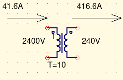

# EEET-241 Final Exam

## Skyler MacDougall

Impedance of the source:
$$
X={V\over I}={4160V\over1000A}\\
Z=4.16\Omega<90^\circ
$$
Angle of the short circuit current is $90^\circ$

The current will go up, because the current requirements will still be the same for the motor. I can barely find anything saying the mathematics of this. Quora is the only place I could find any math remotely similar to what we were looking for, which follows below.

$2.4*20A=48A$

2. 
    $$
    I_p={S\over V\sqrt3}={100KVA\over 2400V}\\
    I_s={S\over V\sqrt3}={100KVA\over 240V}\\
    \overline{\underline{|I_p=41.\overline6A;\ I_s=416.\overline6A|}}
    \\
    Turns\ Ratio\\
    {V_p\over V_s}=a={2400V\over240V}\\
    \overline{\underline{|a=10|}}Note:\ this\ is\ T\ in\ the\ circuit\ diagram\\
    \\
    Base\ KVA\\
    given\ as\ 100KVA\\
    Base\ Impedance\\
    Z_{base}={Z_p (\%)\over Z_n}\\
    Z_{base}={V_p^2\over S}={2400V^2\over 100KVA}\\
    Z_{base}=57.6\Omega\\
    Z_{f_p}={10\%\over57.6\Omega}\approx1.75m\Omega\\
    Z_{f_p}\\
    Z_{f_p}=1.75m\Omega\\
    V_s\\
    V_{Z_{f_p}}=IZ=41.6A*1.75m\Omega\\
    V_{Z_{f_p}}=72.9mV
    $$

3. 

    

    total impedance is $100.00175\Omega$

4. 
    $$
    I_p={V\over X}={2400V\over 100.00175\Omega}\approx24A\\
    I_s=240A\\
    I_L\approx 240A\\
    V_L\approx240V
    $$
    

5. Real power is 0W.
    $$
    Q=S=VI=(2400V*24A)=57.6kVA
    $$

6. Clearly label each voltage.

2. What is the synchronous speed of this motor?
    $$
    n_s=120*{f\over p}=120*{60Hz\over 6 poles}\\
    \overline{\underline{|n_s=1200rpm|}}
    $$

3. How many poles does this motor have?
    $$
    poles = phases * 2 = 3 * 2\\
    \overline{\underline{|6\ poles|}}
    $$

4. What is the slip of this motor?
    $$
    s={n_s-n\over n_s}={1200rpm-1070rpm\over1200rpm}\\
    \overline{\underline{|s=0.108\overline 3|}}
    $$

5. What is the mechanical output in BHP (brake horsepower) of this motor at full speed?
    $$
    rated\ hp * efficiency=10hp * 0.8\\
    \overline{\underline{|8BHP|}}
    $$

6. What is the total impedance $Z_{motor}$ of this motor at full load?
    $$
    Z={V\over FLA}={208V\over30A}=6.9\overline3\Omega\\
    \theta=cos^{-1}(pf)=cos^{-1}(0.7071)\approx cos^{-1}({\sqrt2\over2})=45^\circ\\
    \overline{\underline{|Z=6.9\overline3\Omega<45^\circ|}}
    $$

7. What is the resistive impedance $R_{motor}$ of this motor at full load?
    $$
    |Z|*cos(\theta)={\sqrt2\over2}\\
    R=4.9\Omega
    $$

8. What is the reactive impedance $X_{motor}$ of this motor at full load?
    $$
    |Z|*sin(\theta)=6.9\overline3*{\sqrt2\over2}\\
    X=4.9\Omega
    $$

9. What is the $X\over R$ ratio of the motor?
    $$
    {X\over R}=1
    $$
    

10. What is the full load apparent power drawn by this motor?
    $$
    S=FLA * V * \sqrt3=208V*30A*\sqrt3\\
    S=10.8kVA
    $$

11. What is the Full Load Active power drawn by this motor?
    $$
    P=S*cos(\theta)=10.8kVA*{\sqrt2\over2}\\\overline{\underline{|P=7.63668kW|}}
    $$

12. What is the full load reactive power drawn by this motor?
    $$
    Q=S*sin(\theta)=10.8kVA*{\sqrt2\over2}\\\overline{\underline{|Q=7.63668kW|}}
    $$

13. What is the locked rotor apparent power drawn by the motor?
    $$
    S=V*LRA*\sqrt3=208V*180A*\sqrt3\\
    \underline{\overline{|S=64.8kVA|}}
    $$

14. Determine $I_{secondary_{line}}$.
    $$
    I={S\over V}={10.8kVA\over 208V}\\
    \overline{\underline{|I=51.96A|}}
    $$

15. Determine $I_{secondary_{\phi}}$.
    $$
    I_{line}=I_\phi=51.96A
    $$

16. Determine $I_{primary_{\phi}}$.
    $$
    I_{primary}={I_{secondary}\over a}={51.96A \over 4}\\\overline{\underline{|I_{primary_\phi}=13A|}}
    $$

17. Determine $I_{primary_{line}}$.
    $$
    I_{line}=I_\phi*\sqrt3=13A*\sqrt3\\
    \underline{\overline{|I_{line}=22.5A|}}
    $$

18. Determine $I_{utility_{line}}$.
    $$
    I_{utility}=I_{primary}=22.5A
    $$

19. Determine $P_{secondary_\phi}$.
    $$
    P=VI=120V*51.96A=6.235kW
    $$

20. Determine $P_{secondary_{3\phi}}$
    $$
    P_{3\phi}=3*P=3*6.235kW=18.7kW
    $$

21. Determine $P_{primary_\phi}$.
    $$
    P=VI=480V*13A=6.24kW
    $$

22. Determine $P_{primary_{3\phi}}$
    $$
    P_{3\phi}=3*P=3*6.24kW=18.7kW
    $$

23. Determine $P_{utility}$.
    $$
    P_{utility}=P_{primary_{3\phi}}=18.7kW
    $$

Load current:
$$
I_L={V\over R}={208V\over1000\Omega}\\
I_L=208mA\\
$$
Secondary Current:
$$
I_s=I_L=208mA
$$
Primary Current:
$$
I_p={I_s\over a}={208mA\over 1.15}=180mA
$$

$$
n_s={120f\over p}={120(60Hz)\over 4}\\
s={n_s-n\over n_s}={1800rpm-1700rpm\over1800rpm}\\
s=5.56\%
$$
Once the motor begins to rotate, the motor will begin to rotate with respect to the polarity of the windings. 

In order to change the rotational direction we must change the direction of the windings.

