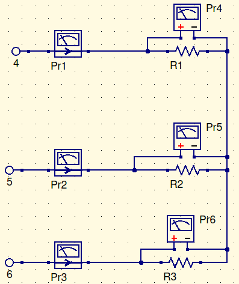
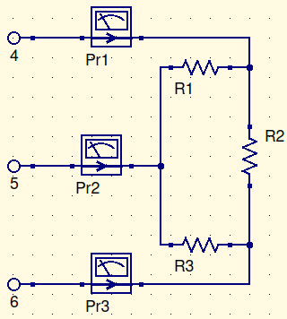
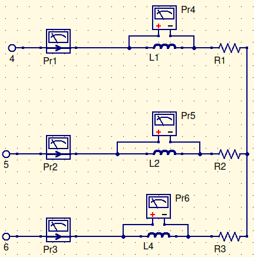

### Objective

The objective of this lab was to study the relationship between voltage and current in wye and delta 3-phase circuits, as well as to determine the real, apparent, and reactive power in said circuits.

# Wiring Diagram

## Part 1

## Part 2

## Part 3

# Procedure

## Part 1

1. Connect the above wye circuit using the resistance and meter modules. **DO NOT** connect to the neutral. 
2. Set each resistance to $400\Omega$ per phase. Use ohmmeter to measure the phase resistance (including the connecting cables).
3. Turn on the power supply and adjust for $208V_{AC}$ line voltage.
4. Measure and record the voltages across the current through the 3 load resistors.
5. Calculate the total power delivered to the three loads.

## Part 2

1. Connect the delta circuit shown above.
2. Set each resistance to $400\Omega$. Before turning on the power suppluy, call the instructor or the TA to inspect your connections.
3. Turn on the power supply and adjust for $120V _{AC}$ line voltage.
4. Measure and record the line voltages.
5. Calculate, using measured data, the total 3-phase power.

## Part 3

1. Connect the above wye circuit shown below. **DO NOT** connect the neutral.
2. Set each resistance to $400\Omega$ and each inductance to $0.8H$.
3. Turn the power supply on and adjust for $208V_{AC}$.
4. Measure and record the line currents and the voltages across each inductive load.
5. Measure and record the voltages across each resistor.
6. Using measured date, calculate the real power on each load.
7. Calculate the total 3-phase real power, the reactive power in each load, the total 3-phase reactive power, the total 3-phase apparent power and the power factor.

# Experimental Data

## Part 1

| Phase | Measured Resistance ($\Omega$) | Line Currents  ($A$) | Load Voltage ($V$) | Per $\phi$ Power ($W$) |
| ----- | ------------------------------ | -------------------- | ------------------ | ---------------------- |
| 1     | 415                            | 0.34                 | 120                | 40.8                   |
| 2     | 413                            | 0.35                 | 120                | 42.0                   |
| 3     | 414                            | 0.34                 | 120                | 40.8                   |

**Total Three-phase power**: $123.6W$

## Part 2

| Phase | Resistance ($\Omega$) | Currents ($A$) | Per $\phi$ Power ($W$) |
| ----- | --------------------- | -------------- | ---------------------- |
| 1     | 400                   | 0.5            | 100                    |
| 2     | 400                   | 0.6            | 144                    |
| 3     | 400                   | 0.55           | 121                    |

**Total three-phase power**: $365W$

## Part 3

| Phase | Measured Current($A$) | Inductive Voltage($V$) | Resistive Voltage($V$) |
| ----- | --------------------- | ---------------------- | ---------------------- |
| 1     | 0.25                  | 67.5                   | 89                     |
| 2     | 0.26                  | 67.5                   | 89                     |
| 3     | 0.25                  | 67.5                   | 89                     |

| Phase | Real Power ($W$) | Reactive Power ($VAR$) | Apparent Power($VA$) | Power Factor |
| ----- | ---------------- | ---------------------- | -------------------- | ------------ |
| 1     | 22.25            | 16.875                 | 27.9                 | 0.80         |
| 2     | 23.14            | 17.550                 | 29.0                 | 0.80         |
| 3     | 22.00            | 16.875                 | 27.7                 | 0.79         |

**Three Phase Real Power**: $67.39W$

**Three Phase Reactive Power**:$51.625VAR$

**Three Phase Apparent Power**:$84.6VA$

**Power Factor**: $0.80$

# Calculations and Analysis

## Power Calculation: Part 1

$$
R_{theory}=400\Omega; I_{in}=0.34\overline3A\\
P=I^2R=(0.34\overline3A)^2(400\Omega)\\
P=47W\\
P_{total}=141W
$$

## Power Calculation: Part 2

$$
P=I^2R; R=400\Omega; I=0.5A;\\
P=(0.5A)^2\times 400\Omega\\
P=100W\\
$$

## Power Calculation: Part 3

$$
P=IV;\hspace{2mm}Q=IV_{reactive} I=0.25A;\hspace{2mm} V_1=67.5V\angle90^\circ; \hspace{2mm} V_2=89V\angle0^\circ\\
Q_1=0.25A\times 67.5V_{reactive}; P_1=0.25A\times89V\\
Q_1=16.875VAR; P_1=22.25W\\
S=\sqrt{P^2+Q^2}\\
S=\sqrt{(22.25W)^2+(16.875VAR)^2}\\
S\approx27.9VA\\
pf={P\over S}={22.25W\over 27.9VA}\\
pf=0.80
$$

# Questions

1. Redo the calculations in part 1 with the ideal resistances of $400\Omega$. How do these results compare to the actual? If the values are different, explain the differences.

---

$$
R_{avg_{meas}}=414\Omega\\
I_{avg_{meas}}=0.34\overline{3}A\\
P_{avg_{meas}}=44.8W\\
P_{total_{meas}}=146W
$$

These numbers are within error of the measured values.

# Results and Conclusions

All of our results were within error. They weren’t exactly the same, because of tolerances and impurities.

For part 1 of the lab, we had a three phase power of $123.6W$. For part 2 of the lab, we had a three phase power of $365W$. For part 3 of the lab, we had $84.6VA \ at \ 0.80pf$.