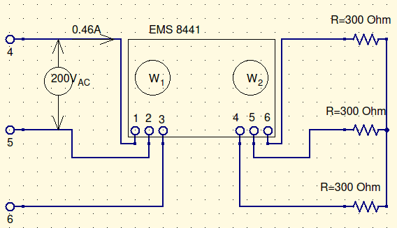
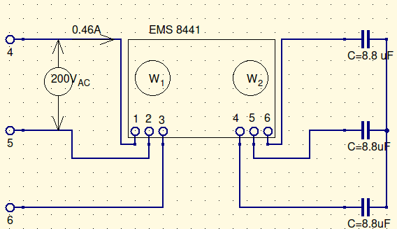
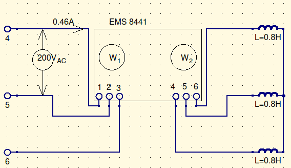
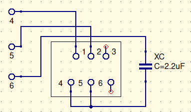
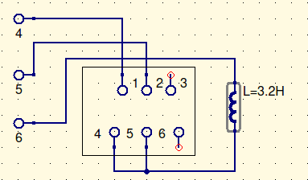

# Objective

The objective of this lab was to measure power in a 3-phase circuit using wattmeters and to determine the phase sequence of a 3-phase line.

# Procedure

For part 1, we connected the power source to a wye resistive, inductive, and capacitive load through a wattmeter, with a voltmeter measuring the line voltage and an ammeter measuring one of the line currents. 

For part 2, we connected the power source to a singular capacitor, by way of a synchronizing switch, as shown in figure 2. 

# Results and Conclusions

All of our results were within error. They weren’t exactly the same, because of tolerances and impurities.

For part 1 of the lab, we had a three phase power of $138.5VA \ at\ pf\approx1$ for the resistive load, $78VA\ at\ pf\approx0.02$ for the capacitive load, and $76VA\ at\ pf\approx0.28$. For part 2,  

# Questions

1. Could 1 wattmeter be used to measure the total 3-phase power on a balanced 3-phase, 4-wire system?

One wattmeter system (consisting of 2 individual wattmeters) would be enough to measure the total power of a 3-phase, 4-wire system.

2. Can a Wattmeter that has I through and V across it indicate $0W$? Explain.

The wattmeter cannot indicate $0W$. Although they are standard wattmeters, they are still used to calculate the complex power output, which means that one of them will register the power if there is any current and voltage through and across them.

3. Could a 3-phase induction motor be used to establish the phase sequence of a 3 phase line?

Yes. The direction of spin of the induction motor will show you where the phases are in reference to each other.

4. Line voltages are $120^\circ$ out of phase with each other. Are the phase voltages also $120^\circ$ out of phase with each other? Explain.

Yes, they are. 

# Wiring Diagrams

## Part 1

***Figure 1: Resistive circuit***

***Figure 2: Capacitive Circuit***

***Figure 3: Inductive Circuit***

***Figure 4: Capacitive Circuit***

***Figure 5: Inductive Circuit***

# Experimental Data

## Part 1

| Type            | Current (A) | Power  $(W_1) $ | Power $(W_2)$ | $S_{3\phi}$(VA) | $P_{3\phi}$(W) | $Q_{3\phi}$(VAR) | $pf_{3\phi}$ |
| --------------- | ----------- | --------------- | ------------- | --------------- | -------------- | ---------------- | ------------ |
| $\Omega_{meas}$ | 0.46        | $+68.5$         | $+70$         | $138.5$         | $138.5$        | $-1.5$           | $\approx1$   |
| $X_{C_{meas}}$  | 0.42        | $-40$           | $+38$         | $78$            | $-2$           | $-78$            | $0.02$       |
| $X_{L_{meas}}$  | 0.46        | $+47$           | $-26$         | $76$            | $21$           | $73$             | $0.28$       |

$$
P_{3\phi}=W_1+W_2=68.5W+70W\\
\underline{\overline{|P_{3\phi}=138.5W|}}\\[12pt]
Q_{3\phi}=W_1-W_2=68.5VAR-70VAR\\
\underline{\overline{|Q_{3\phi}\approx-1.5VAR|}}\\[12pt]
S=\sqrt{P^2+Q^2}\\
S=\sqrt{(138.5W)^2+(-1.5VAR)^2}\\
\underline{\overline{|S_{3\phi}\approx 138.5VA|}}\\[12pt]
pf={P\over S}={138.5W \over 138.5VA}\\
\underline{\overline{|pf_{3\phi}\approx1|}}\\
$$

## Part 2

Upon reading the synchronization unit.

The voltage phasor system rotates $45^\circ$ clockwise from expected, due to the cap. When you swap the lines, it swaps the lamp locations. the voltage phasor system rotates $90^\circ$ counterclockwise from the cap’s location. When you swap lines, it swaps the lamp locations.