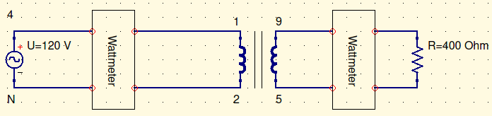
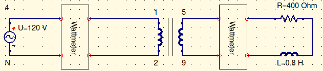
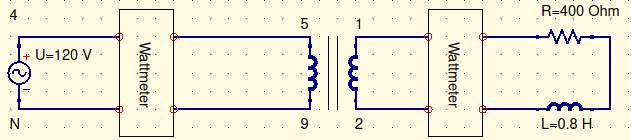
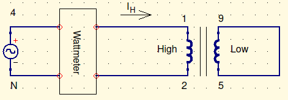
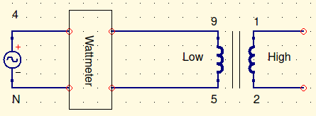
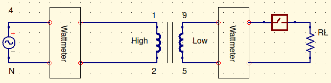

# Objective

The objective of this lab was to study the relationship between primary and secondary values in a single phase transformer.

# Procedure

For lab 3, for each part, connect the power supply to the transformer according to the respective figure below. Then, connect the load to the opposite side of the transformer. Then measure the voltage, current, and power, using the wattmeter.  

# Results and Conclusions

# Wiring Diagrams

## Lab 3

### Figure 1: Resistive Circuit 1

### Figure 2: Resistive Circuit 2

### Figure 3: Resistive and Inductive Circuit 1

### Figure 4: Resistive and inductive Circuit 2

## Lab 4

### Figure 5: Short Circuit Test

### Figure 6: Open Circuit Test

### Load Test

# Experimental Data

## Lab 3

### Resistive Circuit 1

| Measurement | Value          |
| ----------- | -------------- |
| $V_p$       | $120.17V$      |
| $V_s$       | $58.7V$        |
| $I_p$       | $0.0962A$      |
| $I_s$       | $0.1425A$      |
| $P_p$       | $11.30W$       |
| $P_s$       | $8.48W$        |
| $S_p$       | $11.56VA$      |
| $S_s$       | $8.36VA$       |
| $a$         | $\approx2.047$ |

$$
V_p,V_s,I_p,I_s,P_p,P_s\ measured\\
S_p=V_p\times I_p=120.17V\times0.0962A=11.56VA\\
S_s=V_s\times I_s=58.7V\times0.1425A=8.36VA\\
a=\frac{V_p}{V_s}=\frac{120.17V}{58.7V}\approx2.047
$$

### Resistive Circuit 2

| Measurement | Value          |
| ----------- | -------------- |
| $V_p$       | $120.54V$      |
| $V_s$       | $99.03V$       |
| $I_p$       | $0.234A$       |
| $I_s$       | $0.2414A$      |
| $P_p$       | $28.21W$       |
| $P_s$       | $24.25W$       |
| $S_p$       | $28.206VA$     |
| $S_s$       | $23.906VA$     |
| $a$         | $\approx1.217$ |

$$
V_p,V_s,I_p,I_s,P_p,P_s\ measured\\
S_p=V_p\times I_p=120.54V\times0.234A=28.206VA\\
S_s=V_s\times I_s=99.03V\times0.2414A=23.906VA\\
a=\frac{V_p}{V_s}=\frac{120.54V}{99.03V}\approx1.217
$$

### Resistive and Inductive Circuit 1

| Measurement | Value          |
| ----------- | -------------- |
| $V_p$       | $119.95V$      |
| $V_s$       | $58.41V$       |
| $I_p$       | $0.0831A$      |
| $I_s$       | $0.1066A$      |
| $P_p$       | $7.95W$        |
| $P_s$       | $5.19W$        |
| $S_p$       | $9.97VA$       |
| $S_s$       | $6.23VA$       |
| $a$         | $\approx2.054$ |

$$
V_p,V_s,I_p,I_s,P_p,P_s\ measured\\
S_p=V_p\times I_p=119.95V\times0.0831A=9.97VA\\
S_s=V_s\times I_s=58.41V\times0.1066A=6.23VA\\
a=\frac{V_p}{V_s}=\frac{119.95V}{58.41V}\approx2.054
$$

### Resistive and Inductive Circuit 2

| Measurement | Value         |
| ----------- | ------------- |
| $V_p$       | $119.93V$     |
| $V_s$       | $221.8V$      |
| $I_p$       | $1.138A$      |
| $I_s$       | $0.417A$      |
| $P_p$       | $97.9W$       |
| $P_s$       | $77.3W$       |
| $S_p$       | $136.48VA$    |
| $S_s$       | $92.49VA$     |
| $a$         | $\approx0.54$ |

$$
V_p,V_s,I_p,I_s,P_p,P_s\ measured\\
S_p=V_p\times I_p=119.93V\times1.138A=136.48VA\\
S_s=V_s\times I_s=221.8V\times0.417A=92.49VA\\
a=\frac{V_p}{V_s}=\frac{119.93V}{221.8V}\approx0.54
$$

## Lab 4

### Short Circuit Test

| %     | $I_H\ (A)$ | $V_H\ (V)$ | $P_H\ (W)$ |
| ----- | ---------- | ---------- | ---------- |
| $25$  | $0.125$    | $4.26$     | $0.362$    |
| $50$  | $0.25$     | $8.59$     | $1.463$    |
| $75$  | $0.375$    | $12.73$    | $3.17$     |
| $90$  | $0.45$     | $15.25$    | $4.63$     |
| $100$ | $0.5$      | $17.09$    | $5.75$     |

All values measured

### Open Circuit Test

| %     | $V_L\ (V)$ | $I_L\ (A)$ | $P_L\ (W)$ |
| ----- | ---------- | ---------- | ---------- |
| $25$  | $15$       | $0.0227$   | $0.248$    |
| $50$  | $30$       | $0.0339$   | $0.771$    |
| $75$  | $45$       | $0.0458$   | $1.576$    |
| $100$ | $60$       | $0.0600$   | $2.50$     |
| $125$ | $75$       | $0.0829$   | $3.92$     |

All values measured

### Load Test

| $R_L$  | $I_H(A)$ | $V_H(V)$ | $P_H(W)$ | $I_L(A)$ | $V_{L_{NL}}(V)$ | $V_{L_{FL}}(V)$ | $P_L(W)$ | Eff      | % Reg  |
| ------ | -------- | -------- | -------- | -------- | --------------- | --------------- | -------- | -------- | ------ |
| $1200$ | $0.0517$ | $120$    | $5.49$   | $0.0492$ | $59.3$          | $59.6$          | $2.8$    | $51.0\%$ | $0.50$ |
| $600$  | $0.0719$ | $120$    | $8.31$   | $0.0951$ | $59.1$          | $59.6$          | $5.67$   | $68.2\%$ | $0.84$ |
| $400$  | $0.0954$ | $120$    | $11.20$  | $0.1428$ | $58.7$          | $59.6$          | $8.48$   | $75.7\%$ | $1.51$ |
| $300$  | $0.1234$ | $120$    | $14.62$  | $0.1996$ | $58.6$          | $59.6$          | $11.79$  | $80.6\%$ | $1.68$ |
| $240$  | $0.1470$ | $120$    | $17.43$  | $0.2463$ | $58.3$          | $59.6$          | $14.50$  | $83.2\%$ | $2.18$ |
| $200$  | $0.1688$ | $120$    | $20.04$  | $0.2903$ | $57.9$          | $59.6$          | $16.98$  | $84.7\%$ | $2.85$ |

$$
eff(\%)=\frac{P_L}{P_H}=\frac{2.8}{5.49}\approx51.0\%\\
\%\ reg = \frac{V_{L_{NL}-V_{L_{FL}}}}{V_{L_{FL}}}=\frac{59.3-59.6}{59.6}=0.50\%
$$

