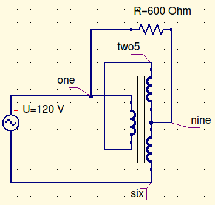

# Objective

The objective of this lab was to experimentally look at the polarity of the wiring of a single phase autotransformer.

# Procedure

First, we connected up a simple transformer circuit, with an open. This allowed us to find the transformers polarity, and understand how to set up all future circuits. We then set up a definite step-up transformer and a step-down transformer, using two different coils, one at a time. Finally, we set up a multi-coil autotransformer, in both step up and step-down configurations.

# Results and Conclusions

In this lab we learned the polarity of the transformers used in lab. All of these circuits are correct, and the numbers we got are fairly reasonable. 

# Wiring Diagrams

*Figure 1: Polarity Test Diagram*

[^1]

*Figure 2: Single Coil Autotransformer (Step Up)*

[^1]

*Figure 3: Single Coil Autotransformer (Step Down)*

[^2]

*Figure 4: Multi-Coil Autotransformer (Step Up)*

[^2]

*Figure 5: Multi-Coil Autotransformer (Step Down)*

*Figure 6: Transformer Guide*

[^1]:In these tests, the $V_{in}$ was actually 60V.

[^2]: In these diagrams, the numbers are typed due to QUCS not accepting numbers in the annotations as the first character. Annotations with two numbers represent nodes in the transformer depicted in Figure 6 that were connected for the lab.

# Experimental Data

## Polarity Tests

These are set up according to the Figure 1 in the wiring diagrams. The numbers refer to the transformer boxes used in lab, which is shown in Figure 6. 

| Setup                            | $V_s$ (V) | Polarity    |
| -------------------------------- | --------- | ----------- |
| $H_1=2;\ H_2=1;\ X_1= 9;\ X_2=5$ | $59.5$    | Step Down   |
| $H_1=2;\ H_2=1;\ X_1= 5;\ X_2=9$ | $178$     | Step Up     |
| $H_1=2;\ H_2=1;\ X_1= 2;\ X_2=7$ | $16$      | Step Down   |
| $H_1=2;\ H_2=1;\ X_1= 7;\ X_2=2$ | $100.8$   | Step Up[^3] |

[^3]:don’t completely understand why this happened. While this is configured as a step up transformer, the voltage is still low. I don’t completely understand why this happened.

## Single Coil Autotransformer (Step Up)

These are set up according to the Figure 2 in the wiring diagrams. The numbers refer to the transformer boxes used in lab, which is shown in Figure 6. 

| Setup                     | $V_L$ (V) | $I_{p_{in}}$(A) | $I_{p_{out}}$(A) | $I_L$(A) |
| ------------------------- | --------- | --------------- | ---------------- | -------- |
| $H_1= 3;\ H_2= 7;\ X_2=8$ | $100$     | $0.297$         | $0.297$          | $0.161$  |
| $H_1= 5;\ H_2= 9;\ X_2=6$ | $117.6$   | $0.417$         | $0.417$          | $0.189$  |

## Single Coil Autotransformer (Step Down)

These are set up according to the Figure 3 in the wiring diagrams. The numbers refer to the transformer boxes used in lab, which is shown in Figure 6. 

| Setup                     | $V_L$ (V) | $I_{p_{in}}$(A) | $I_{p_{out}}$(A) | $I_L$(A) |
| ------------------------- | --------- | --------------- | ---------------- | -------- |
| $H_1= 3;\ H_2= 7;\ X_2=8$ | $34.3$    | $0.0552$        | $0.0552$         | $0.0387$ |
| $H_1= 5;\ H_2= 9;\ X_2=6$ | $29.7$    | $0.0381$        | $0.0381$         | $0.0479$ |

## Multi-Coil Autotransformer (Step Up)

These are set up according to the Figure 4 in the wiring diagrams. The numbers refer to the transformer boxes used in lab, which is shown in Figure 6. 

| $V_{15}$ (V) | $V_{19}$(V) | $I_{p_{in}}$(A) | $I_{p_{out}}$(A) | $I_L$(A) |
| ------------ | ----------- | --------------- | ---------------- | -------- |
| $34.3$       | $176.3$     | $0.0427$        | $0.0427$         | $0.0285$ |

## Multi-Coil Autotransformer (Step Down)

These are set up according to the Figure 5 in the wiring diagrams. The numbers refer to the transformer boxes used in lab, which is shown in Figure 6. 

| $V_{12}$(V) | $V_{15}$(V) | $V_{19}$(V) |
| ----------- | ----------- | ----------- |
| $59.72$     | $59.72$     | $88.8$      |

