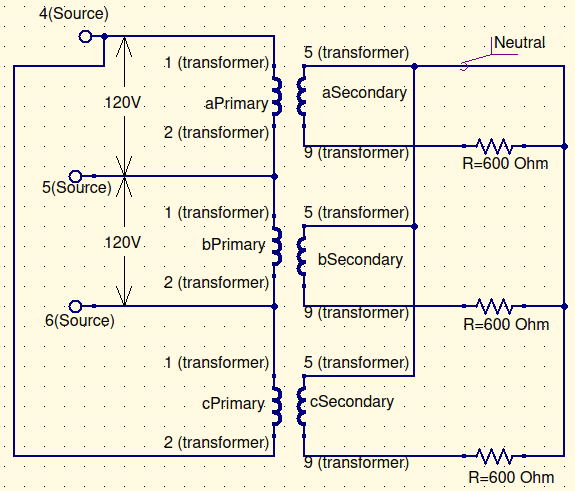
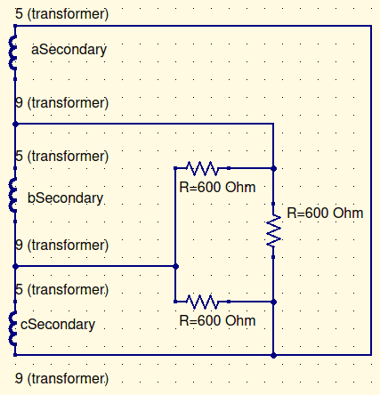
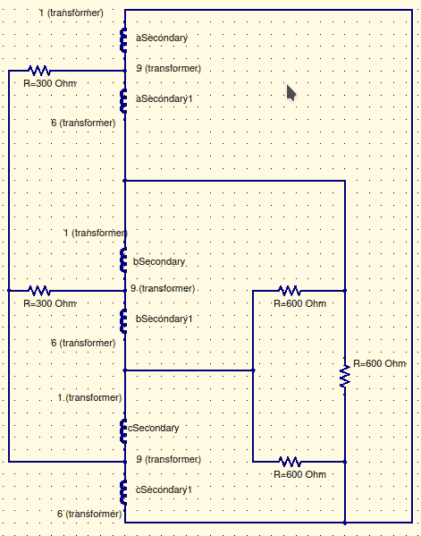
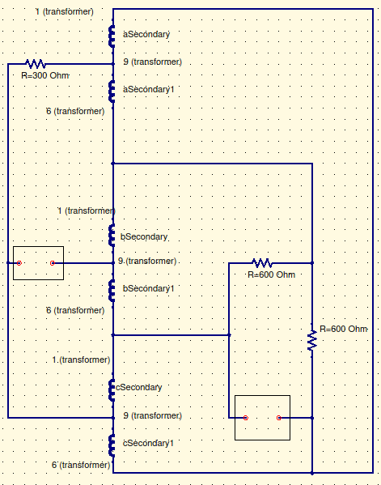
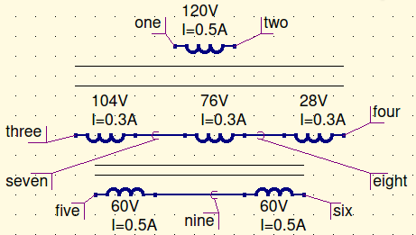

# Objective

The objective of this lab was to experimentally look at the wiring and measurement of values in three-phase transformer circuits.

# Procedure

First, we connected the power supply to the load through a Delta-Wye transformer. We then collected measurements, and changed the transformer to be a Delta-Delta transformer. After collecting the same measurements, we then 

# Results and Conclusions

# Wiring Diagrams

[^1]

*Figure 1: Delta-Wye Transformer Diagram*

*Figure 2: Delta-Delta Transformer Diagram*

*Figure 3: Delta-Delta Split Phase Transformer Diagram*

[^2]

*Figure 3: Delta-Delta Split Phase Transformer* ***unbalanced*** *Diagram*

*Figure 6: Single Transformer Guide*

[^1]:The source side of this circuit is used in all other configurations in this lab. This will not be repeated in future configurations, to save space.
[^2]:Boxes over gaps denote removed resistors

# Experimental Data

## Delta-Wye Transformer

### Voltage (V)

<<<<<<< HEAD
| Location    | Line   | Phase | Line (ideal) | Phase (ideal) |
| ----------- | ------ | ----- | ------------ | ------------- |
| Primary 1   | 206.63 | 119.3 | 120          | 120           |
| Primary 2   | 201.26 | 116.2 | 120          | 120           |
| Primary 3   | 203.34 | 117.4 | 120          | 120           |
| Secondary 1 | 101.70 | 58.72 | 103.92       | 60            |
| Secondary 2 | 101.62 | 58.67 | 103.92       | 60            |
| Secondary 3 | 101.50 | 58.60 | 103.92       | 60            |
=======
| Location            | Measured | Ideal | Error |
| ------------------- | -------- | ----- | ----- |
| Primary 1 (phase)   | 119.3    | 120   |       |
| Primary 1 (line)    |          |       |       |
| Primary 2 (phase)   | 116.2    | 120   |       |
| Primary 2 (line)    |          |       |       |
| Primary 3 (phase)   | 117.4    | 120   |       |
| Primary 3 (line)    |          |       |       |
| Secondary 1 (phase) | 58.72    | 60    |       |
| Secondary 1 (line)  |          |       |       |
| Secondary 2 (phase) | 58.67    | 60    |       |
| Secondary 2 (line)  |          |       |       |
| Secondary 3 (phase) | 58.60    | 60    |       |
| Secondary 3 (line)  |          |       |       |
>>>>>>> acba6896f2a9a9eee4514aef623a2127202e38f0

$$
In\ \Delta,V_L=\sqrt3V_\phi=\sqrt3(119.3V)=206.63\\In\ Y,V_L=V_\phi
$$

### Current (A)

<<<<<<< HEAD
| Location    | Line  | Phase | Line (ideal) | Phase (ideal) |
| ----------- | ----- | ----- | ------------ | ------------- |
| Primary 1   | 0.117 |       | 0.050        | 0.050         |
| Primary 2   | 0.118 |       | 0.050        | 0.050         |
| Primary 3   | 0.117 |       | 0.050        | 0.050         |
| Secondary 1 | 0.097 | 0.097 | 0.100        | 0.100         |
| Secondary 2 | 0.097 | 0.097 | 0.100        | 0.100         |
| Secondary 3 | 0.097 | 0.097 | 0.100        | 0.100         |
=======
| Location            | Measured | Ideal | Error |
| ------------------- | -------- | ----- | ----- |
| Primary 1 (phase)   |          | 0.028 |       |
| Primary 1 (line)    | 0.117    | 0.050 |       |
| Primary 2 (phase)   |          | 0.028 |       |
| Primary 2 (line)    | 0.118    | 0.050 |       |
| Primary 3 (phase)   |          | 0.028 |       |
| Primary 3 (line)    | 0.117    | 0.050 |       |
| Secondary 1 (phase) |          | 0.100 |       |
| Secondary 1 (line)  | 0.097    | 0.100 |       |
| Secondary 2 (phase) |          | 0.100 |       |
| Secondary 2 (line)  | 0.097    | 0.100 |       |
| Secondary 3 (phase) |          | 0.100 |       |
| Secondary 3 (line)  | 0.097    | 0.100 |       |
>>>>>>> acba6896f2a9a9eee4514aef623a2127202e38f0

$$
In\ Y, I_L=I_\phi\\In\ \Delta, I_L=\sqrt3I_\phi
$$

### Miscellaneous

| Measurement              | Value  | Ideal Value |
| ------------------------ | ------ | ----------- |
| $R_{1_{calc}}\ (\Omega)$ | 605    | 600         |
| $R_{2_{calc}}\ (\Omega)$ | 604    | 600         |
| $R_{3_{calc}}\ (\Omega)$ | 604    | 600         |
| $a_a$                    | 2.0316 | 2.0         |
| $a_b$                    | 1.9806 | 2.0         |
| $a_c$                    | 2.0034 | 2.0         |
| $P_{\phi a_p}\ (W)$      | 9.602  |             |
| $P_{\phi b_p}\ (W)$      | 9.548  |             |
| $P_{\phi c_p}\ (W)$      | 9.546  |             |
| $P_{\phi a_s}\ (W)$      | 5.577  | 6.0         |
| $P_{\phi b_s}\ (W)$      | 5.567  | 6.0         |
| $P_{\phi c_s}\ (W)$      | 5.534  | 6.0         |
| $P_{3\phi_p}\ (W)$       | 28.696 |             |
| $P_{3\phi_s}\ (W)$       | 16.678 | 18.0        |

## Delta-Delta Transformer

### Voltage (V)

| Location    | Line | Phase | Line (ideal) | Phase (ideal) |
| ----------- | ---- | ----- | ------------ | ------------- |
| Primary 1   |      |       |              |               |
| Primary 2   |      |       |              |               |
| Primary 3   |      |       |              |               |
| Secondary 1 |      |       |              |               |
| Secondary 2 |      |       |              |               |
| Secondary 3 |      |       |              |               |

### Current (A)

| Location    | Line | Phase | Line (ideal) | Phase (ideal) |
| ----------- | ---- | ----- | ------------ | ------------- |
| Primary 1   |      |       |              |               |
| Primary 2   |      |       |              |               |
| Primary 3   |      |       |              |               |
| Secondary 1 |      |       |              |               |
| Secondary 2 |      |       |              |               |
| Secondary 3 |      |       |              |               |

### Miscellaneous

| Measurement              | Value | Ideal Value |
| ------------------------ | ----- | ----------- |
| $R_{1_{calc}}\ (\Omega)$ |       | 600         |
| $R_{2_{calc}}\ (\Omega)$ |       | 600         |
| $R_{3_{calc}}\ (\Omega)$ |       | 600         |
| $a_a$                    |       |             |
| $a_b$                    |       |             |
| $a_c$                    |       |             |
| $P_{3\phi_p}\ (W)$       |       |             |
| $P_{3\phi_s}\ (W)$       |       |             |

## Delta-Delta With Split Phase Transformer

### Voltage (V)

| Location  | Line | Phase | Line (ideal) | Phase (ideal) |
| --------- | ---- | ----- | ------------ | ------------- |
| Primary 1 |      |       |              |               |
| Primary 2 |      |       |              |               |
| Primary 3 |      |       |              |               |
| $R_1$     |      |       |              |               |
| $R_2$     |      |       |              |               |
| $R_3$     |      |       |              |               |
| $R_4$     |      |       |              |               |
| $R_5$     |      |       |              |               |

### Current (A)

| Location  | Line | Phase | Line (ideal) | Phase (ideal) |
| --------- | ---- | ----- | ------------ | ------------- |
| Primary 1 |      |       |              |               |
| Primary 2 |      |       |              |               |
| Primary 3 |      |       |              |               |
| $R_1$     |      |       |              |               |
| $R_2$     |      |       |              |               |
| $R_3$     |      |       |              |               |
| $R_4$     |      |       |              |               |
| $R_5$     |      |       |              |               |

### Miscellaneous

| Measurement              | Value | Ideal Value |
| ------------------------ | ----- | ----------- |
| $R_{1_{calc}}\ (\Omega)$ |       |             |
| $R_{2_{calc}}\ (\Omega)$ |       |             |
| $R_{3_{calc}}\ (\Omega)$ |       |             |
| $a_a$                    |       |             |
| $a_b$                    |       |             |
| $a_c$                    |       |             |
| $P_{3\phi_p}\ (W)$       |       |             |
| $P_{3\phi_s}\ (W)$       |       |             |

## Delta-Delta With Split Phase Transformer - Unbalanced Load

### Voltage (V)

| Location  | Line | Phase | Line (ideal) | Phase (ideal) |
| --------- | ---- | ----- | ------------ | ------------- |
| Primary 1 |      |       |              |               |
| Primary 2 |      |       |              |               |
| Primary 3 |      |       |              |               |
| $R_1$     |      |       |              |               |
| $R_2$     |      |       |              |               |
| $R_3$     |      |       |              |               |
| $R_4$     |      |       |              |               |
| $R_5$     |      |       |              |               |

### Current (A)

| Location  | Line | Phase | Line (ideal) | Phase (ideal) |
| --------- | ---- | ----- | ------------ | ------------- |
| Primary 1 |      |       |              |               |
| Primary 2 |      |       |              |               |
| Primary 3 |      |       |              |               |
| $R_1$     |      |       |              |               |
| $R_2$     |      |       |              |               |
| $R_3$     |      |       |              |               |
| $R_4$     |      |       |              |               |
| $R_5$     |      |       |              |               |

### Miscellaneous

| Measurement              | Value | Ideal Value |
| ------------------------ | ----- | ----------- |
| $R_{1_{calc}}\ (\Omega)$ |       |             |
| $R_{2_{calc}}\ (\Omega)$ |       |             |
| $R_{3_{calc}}\ (\Omega)$ |       |             |
| $a_a$                    |       |             |
| $a_b$                    |       |             |
| $a_c$                    |       |             |
| $P_{3\phi_p}\ (W)$       |       |             |
| $P_{3\phi_s}\ (W)$       |       |             |

