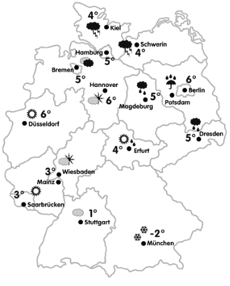

**Name: Skyler MacDougall**

**Klasse: 03**

**Datum: 3/21/2020**

# I. Hörverständnis

## A. Write down what you hear. [6 Punkte]

1. Ich magt din fuhling und din herbst.

2. Die sie ja, machen vier umlaub in eusterich.

3. Der Winter in Deutschlan ist nicht zu kalt. 

## B. Write down the sentences you hear. Then respond to each one with a brief but complete sentence in German. [18 Punkte]

1. Wie ist das Klima in Deutschland?
    Das Klima in Deutschland ist warm.

2. Mögen sie den schnee?
    Ja, ich möge den shnee.

# II. Grammatik

## C. Prepositions in the accusative case. Complete the following sentences with the correct accusative prepositions. Don’t forget to modify the articles or posessive adjectives! [18 Punkte]

1. Der Vater kauft Brötchen für seine Kinder.

2. Was hast du denn gegen die Lehrerin?

3. Ich bin nicht hungrig. Frühstückt doch ohne uns.

4. Wir wandern gern durch das Museum. 
5.  Gehen wir doch um der See. 
6. Leider müssen Sie bis April warten. 

## D. Prepositions in the accusative case. Complete the following sentences with the correct accusative prepositions. Choose from the word bank.

durch | für  | gegen | ohne | um 

Selda und Hasan gehen heute durch der Park (m). Sie gehen bis der See (m) und sprechen über die Universität. Hasan mag seinen Deutschkurs nicht und sagt etwas ohne seinen Deutschprofessor (m). Selda geht in die Buchhandlung. Sie kauft ein Buch für ihr Englischkurs (m). Julian ist auch da. Er fragt Selda und Hasan: “Kummt ihr mit ins Kino?” Selda und Hasan kommen aber nicht mit. Sie arbeiten heute Abend. Julian geht also bis seine Freunde (pl) ins Kino. 

## E. The imperative

### Part 1

Sie haben einge Party zuhausae und sprechen mit den Gästen. Bilden Sie Imperative aus den Stazelementen. (You are hosting a party at home and you’re talking to the guests. Build imperatives based on the sentence elements provided below.) **[15 Punkte]**

**Beispiel: *etwas Käse nehmen (Julia)    ==Julia, nimm etwas Käse!==* ** 

1. ein Glas Wein trinken (Sarah und Luca)
    Sarah und Luca, trinkt ein Glas Wein!
2. Gitarre spielen (David)
    David, spiele Gitarre!
3. ein Stuck Brot essen (Professor Hauser)
    Professor Hauser, essen Sie ein Stuck Brot!
4. noch ein bisschen bleiben (Annika und Peter)
    Annika und Peter, bleibet noch ein bisschen!
5. lustig sein (Frau Müller)
    Frau Müller, seien Sie lustig!

### Part 2

Sie machen Pläne für heute Abend. Ihre Freundin schlägt Aktivitäten vor un Sie sagen was Sie machen möchten. (You have plans for tonight. Your friend is making suggestions. You decide which activity you would like to do. **Only choose one activity of the two choices in each exercise.**) **[12 Punkte]**

**Beispiel: *heute Abend ins Kino/Theater gehen    ==Gehen wir doch ins Theater!==* ** 

1. mit dem Bus/mit dem Auto fahren
    Fahren wir mit dem Auto!
2. eine Pizza/eine Hamburger essen
    Essen wir eine Pizza!
3. in der Kneipe einen Wein / eine Cola trinken
    Trinken wir in der Kneipe eine Cola!
4. Hausaufgaben machen / einen Film sehen
    Machen wir Hausaufgaben!

## F. möchten vs mögen vs gern. Translate the following English sentences to German, using either möchten, mögen, or gern [12 Punkte].

1. I like to drink coffee.
    Ich möchte Kaffee trinken.
2. I like coffee.
    Ich möge Kaffee.
3. Would you like to drink a coffee with me?
    Gern trinken ein Kaffee mit mich.

# III. Vokabeln

## G. Schreiben Sie das Nomen (mit Artikel) für jedes Adjektiv auf. [12 Punkte]

| sonnig     | ==die Sonne== |
| ---------- | ------------- |
| verschneit | die schnee    |
| regnerisch | die regen     |
| warm       | warum         |
| windig     | wind          |

## H. Sentence Adverbs. You will read some questions. Answer each question with a complete sentence. Begin your answer with each of the adverbs in the list below. 

Gott sei Dank | leider | selbstverständlich | sicher

1. Lernen Sie gern Deutsch?
    Selbstverständlich, lerne ich gern Deutsh.
2. Sind Sie freundlich?
    Sicher, bin ich freundlich.
3. Hören Sie gern Musik?
    Gott sei Dank, höre ich gern Musik.

## I. Wie is das Wetter in… 

Answer in complete sentences. [9 Punkte]

1. in München?
    Es schneit, und es ist kalt.
2. in Erfurt?
    Die Sonne schient, und es ist vier Grade Celsius.
3. in Dresden?
    Es regnet, und es ist funf Grade Celsius.

# IV. Kulturelles Thema

## J. Das Klima in Deutschland. Answer the following questions in English. [12 Punkte]

1. Describe the german climate. [2 Punkte]
    The german climate is varied, and follows all of the seasons similar to here.
2. In which direction do the four largest rivers flow? [2 Punkte]
    South to north.
3. In which direction does the *Donau* flow? [2 Punkte]
    West to east.
4. Describe the geographical differences between Northern Germany, the Middle and the South of Germany. [6 Punkte]
    The north is flat, the middle is hilly, and the south is mountainous, with forests.

## K. The Common Origin of German and English [3 Punkte]

1. The limes is a “wall” of Roman fortifications intended to halt Germanic expansion to the South in to the Roman Empire.
    a. True    ==b. False==
2. Remains of the limes can be seen today.
    ==a. True==    b. False
3. In the 5th Century AD, the Germanic Angles and Saxon tribes migrated to the British Isles. The Germanic language then evolved into Modern English. German and English thus share a common origin.
    ==a. True==    b. False