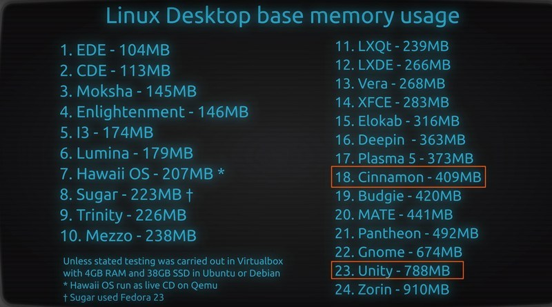

# Desktop Environments

## For when terminals just don’t do it

DE’s have two portions

- Window managers, which manage
    - windows
    - icons
    - menus
    - pointers
- widget toolkit
    - used to write applications with a unified look/behavior

# Top 9 DEs

## GNOME3

- easy to use
- “most” popular
- Nautilus is the default file manager
- uses more of the system (CPU, RAM, and storage)
- Not a ton of customizability
- Widgets built using JavaScript

## KDE Plasma

- dolphin file manager
- easy to use
- uniform software stack
- efficient
- tons of widgets
- easy to customize

You can make KDE look like any other DE.

“If your KDE looks bad, you’re doing it wrong”

## XFCE

- Lightweight
- doesn’t eat battery
- easy to use
- Thunar file manager

Manjaro uses XFCE

## Cinnamon

- Fork of GNOME3
- Nemo file manager
- “Christ look”
- tons of desklets
- very stable

Mint uses Cinnamon

## MATE

- extension of GNOME2
- Caja file manager

essentially just GNOME2

## Unity

- technically not a DE
- extension of GNOME
- desktop environment shell

This is where Ubuntu gets its sidebar. (Ubuntu used to use it, now uses base GNOME3)

## LXQt

- extremely lightweight
- easy to use

Someone has used it… at some point… probably…

## Pantheon

- DE designed for Elementary OS
- OSX like interface
- looks amazing
- due to its simplicity, its missing some thing that are commonplace in other DEs
    - prevents you from doing tons of customization
- good if you just want it to work, no modifications

## Deepin

- Simple
- Elegant
    - “looks like a kids MacOS”
- Developed by a Chinese community
    - could be a security problem because the Chinese government
- All of the widgets use JavaScript

Would be amazing, if not for the Chinese.

*club devolves into Chinese discussion and evidence of backdoors*

Deepin outperforms gnome

## EDE

- Looks like windows 95
- extremely lightweight
- last stable release was in 2014
- extreme efficiency

# Window Managers

Specifically controls placement and appearance of windows

Doesn’t come with ANY other tools

There’s no apps, plugins, etc. etc.

- GNOME
    - mutter/gnomeshell
- KDE
    - KWin

3 forms of Window Managers

## Stacking

Traditional desktop design.

Act like pieces of paper. Most major DEs use a stacking window manager

## Tiling

- Nothing overlaps. heaviliy uses keybindings

- automatically tiles windows when opened

- most commonly split screen space in half

- made to maximize screen utility

- no fancy animations

- strong kebinding support for minimal mouse usage

Examples: 

- i3
    - Fun fact: you can run i3 inside other window manager
    - technically can be stacking, if you force it to
- BSPWM
    - technically can be stacking, if you force it to
- Sway
- Herbstluftwm

Zephyr allows you to start an X session within an X session. This allows you to test out various DEs within your current one.

## Dynamic

Switches between the above two on start

- Awesome
    - written in Lua
- dwm
    - written in C
    - Part of the suckless project
- xmonad
    - haskell

# WM vs DE

## Pros for WM

- highly configurable
- text-based config
- lightweight
- doesn’t come with bells and whistles

## Cons for WM

- long time to set up
- still need to handle
    - displays
    - power management
    - etc
- doesn’t come with bells and whistles